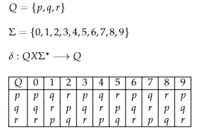
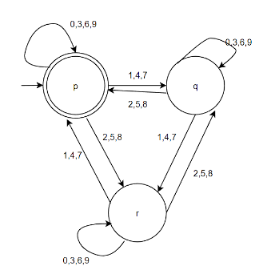
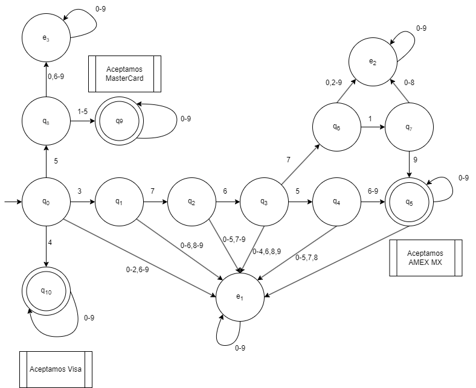

#Sobre Los Autómatas Finitos Deterministas

!!! Note ""
    Un AFD es una máquina que puede leer símbolos de un alfabeto y cambiar de estado según reglas predefinidas. Puede comenzar en un estado inicial, moverse de estado en estado y, al finalizar, puede llegar a un estado de aceptación indicando que ha reconocido una secuencia válida de símbolos.

    Definiendo esto podemos usar los AFD para determinar si una secuencia númerica como la de las tarjetas de credito expedidas por cierto banco es valido o no.

## Definiendo matemáticamente un AFD.

Definición: Un Autómata Finito Determinista (AFD) se define como una 5-tupla (Q, Σ, δ,  q₀, F), donde:

- Q es un conjunto finito de estados.
- Σ es un alfabeto finito de símbolos de entrada.
- δ es la función de transición, δ: Q x Σ → Q, que especifica la transición de un estado a otro dado un símbolo de entrada.
- q₀ es el estado inicial,  q₀ ∈ Q.
- F es un conjunto de estados de aceptación, F ⊆ Q.

## Definiendo un AFD de manera gráfica.

Un AFD puede ser definido por medio de un diagrama que exprese los saltos que hay entre sus estados, o una tabla de transiciones. A continuación se da el ejemplo de un AFD que acepta cadenas compuestas por números naturales (estas cadenas pueden ser vistas como números enteros positivos) y con sus transiciones determinará si este número entero positivo es divisible entre tres.
 
 
 

 

## Propuesta de Automata Finito Determinista.

!!! Success "Requerimiento"
    En un establecimiento de comida solo es admitido los pagos con tarjeta de credito o debito si es que son emitidas por American Express, Visa o MasterCard ya que es un establecimiento muy exclusivo, el establecimiento solo puede aceptar pagos de American Express si esta fue expedida en México, mientras que para Visa o MasterCard no tiene ningun problema.
     
    Es necesario crear un autómata finito determinista que sea capaz de determinar si una tarjeta entrante de 16 digitos es del grupo American Express y esta expedida en México o bien si es del grupo Visa o MasterCard.

### Lista de tarjetas aceptadas.

Consultando la siguiente pagina que filtra los codigos BIN'S por banco expedido y país de procedencía, encontramos la siguiente lista de codigos asignados a día de hoy para México que puede utilizar American Express.

<table id="tg-yourt" class="tg">
<thead>
  <tr>
    <th class="tg-rqt1">Número Bin</th>
    <th class="tg-rqt1">País</th>
    <th class="tg-n715">Banco Emisor</th>
    <th class="tg-n715">Tipo de Tarjeta</th>
  </tr>
</thead>
<tbody>
  <tr>
    <td class="tg-5kiu">376560 - 376599</td>
    <td class="tg-5kiu">México</td>
    <td class="tg-2z80">AMERICAN EXPRESS</td>
    <td class="tg-2z80">CREDITO</td>
  </tr>
  <tr>
    <td class="tg-5kiu">376719 </td>
    <td class="tg-5kiu">México</td>
    <td class="tg-2z80">AMERICAN EXPRESS</td>
    <td class="tg-2z80">CREDITO</td>
  </tr>
</tbody>
</table>

[Bin Check Online](https://bincheck.io/es/mx/american-express)

!!! Note "" 

    Adicionalmente sabemos que las tarjetas mundialmente de Visa empiezan siempre por el digito __4__ mientras que las MasterCard empiezan por los digitos __51 - 55__.

### Definiendo el autómata finito determinista.
Podemos definir el automata finito determinista con los siguientes elementos:

- Q = {q0, q1, q2, q3, q4, q5, q6, q7, q8, q9, q10, e1, e2, e3}.
- Σ = {0,1,2,3,4,5,6,7,8,9}
- q0 es el estado inicial donde q0 ∈ Q.
- F = {q5, q9, q10} es un conjunto de estados de aceptación, F ⊆ Q.

Damos su función de transcisión de una manera tabular como mostramos arriba de la siguiente forma:

<table id="tg-IVwFI" class="tg">
<thead>
  <tr>
    <th class="tg-rqt1">Estado / Entrada</th>
    <th class="tg-rqt1">0</th>
    <th class="tg-rqt1">1</th>
    <th class="tg-rqt1">2</th>
    <th class="tg-mnbu">3</th>
    <th class="tg-mnbu">4</th>
    <th class="tg-mnbu">5</th>
    <th class="tg-mnbu">6</th>
    <th class="tg-mnbu">7</th>
    <th class="tg-mnbu">8</th>
    <th class="tg-mnbu">9</th>
  </tr>
</thead>
<tbody>
  <tr>
    <td class="tg-uwry">q0</td>
    <td class="tg-5kiu">e1</td>
    <td class="tg-fwci">e1</td>
    <td class="tg-fwci">e1</td>
    <td class="tg-popv">q1</td>
    <td class="tg-popv">q10</td>
    <td class="tg-popv">q8</td>
    <td class="tg-popv">e1</td>
    <td class="tg-popv">e1</td>
    <td class="tg-popv">e1</td>
    <td class="tg-popv">e1</td>
  </tr>
  <tr>
    <td class="tg-uwry">q1</td>
    <td class="tg-jqsm">e1</td>
    <td class="tg-w0xu">e1</td>
    <td class="tg-w0xu">e1</td>
    <td class="tg-9k4j">e1</td>
    <td class="tg-9k4j">e1</td>
    <td class="tg-9k4j">e1</td>
    <td class="tg-9k4j">e1</td>
    <td class="tg-popv">q2</td>
    <td class="tg-9k4j">e1</td>
    <td class="tg-9k4j">e1</td>
  </tr>
  <tr>
    <td class="tg-v1t9">q2</td>
    <td class="tg-9k4j">e1</td>
    <td class="tg-9k4j">e1</td>
    <td class="tg-9k4j">e1</td>
    <td class="tg-9k4j">e1</td>
    <td class="tg-9k4j">e1</td>
    <td class="tg-9k4j">e1</td>
    <td class="tg-popv">q3</td>
    <td class="tg-9k4j">e1</td>
    <td class="tg-9k4j">e1</td>
    <td class="tg-9k4j">e1</td>
  </tr>
  <tr>
    <td class="tg-v1t9">q3</td>
    <td class="tg-9k4j">e1</td>
    <td class="tg-9k4j">e1</td>
    <td class="tg-9k4j">e1</td>
    <td class="tg-9k4j">e1</td>
    <td class="tg-9k4j">e1</td>
    <td class="tg-popv">q4</td>
    <td class="tg-9k4j">e1</td>
    <td class="tg-popv">q6</td>
    <td class="tg-9k4j">e1</td>
    <td class="tg-9k4j">e1</td>
  </tr>
  <tr>
    <td class="tg-v1t9">q4</td>
    <td class="tg-popv">e1</td>
    <td class="tg-9k4j">e1</td>
    <td class="tg-9k4j">e1</td>
    <td class="tg-9k4j">e1</td>
    <td class="tg-9k4j">e1</td>
    <td class="tg-9k4j">e1</td>
    <td class="tg-popv">q5</td>
    <td class="tg-popv">q5</td>
    <td class="tg-popv">q5</td>
    <td class="tg-popv">q5</td>
  </tr>
  <tr>
    <td class="tg-v1t9">q5</td>
    <td class="tg-popv">q5</td>
    <td class="tg-popv">q5</td>
    <td class="tg-popv">q5</td>
    <td class="tg-9k4j">q5</td>
    <td class="tg-9k4j">q5</td>
    <td class="tg-9k4j">q5</td>
    <td class="tg-9k4j">q5</td>
    <td class="tg-9k4j">q5</td>
    <td class="tg-9k4j">q5</td>
    <td class="tg-9k4j">q5</td>
  </tr>
  <tr>
    <td class="tg-v1t9">q6</td>
    <td class="tg-popv">e2</td>
    <td class="tg-popv">q7</td>
    <td class="tg-popv">e2</td>
    <td class="tg-popv">e2</td>
    <td class="tg-9k4j">e2</td>
    <td class="tg-9k4j">e2</td>
    <td class="tg-9k4j">e2</td>
    <td class="tg-9k4j">e2</td>
    <td class="tg-9k4j">e2</td>
    <td class="tg-9k4j">e2</td>
  </tr>
  <tr>
    <td class="tg-v1t9">q7</td>
    <td class="tg-9k4j">e2</td>
    <td class="tg-9k4j">e2</td>
    <td class="tg-9k4j">e2</td>
    <td class="tg-9k4j">e2</td>
    <td class="tg-9k4j">e2</td>
    <td class="tg-9k4j">e2</td>
    <td class="tg-9k4j">e2</td>
    <td class="tg-9k4j">e2</td>
    <td class="tg-9k4j">e2</td>
    <td class="tg-popv">q5</td>
  </tr>
  <tr>
    <td class="tg-v1t9">q8</td>
    <td class="tg-popv">e3</td>
    <td class="tg-popv">q9</td>
    <td class="tg-9k4j">q9</td>
    <td class="tg-9k4j">q9</td>
    <td class="tg-9k4j">q9</td>
    <td class="tg-9k4j">q9</td>
    <td class="tg-popv">e3</td>
    <td class="tg-9k4j">e3</td>
    <td class="tg-9k4j">e3</td>
    <td class="tg-9k4j">e3</td>
  </tr>
  <tr>
    <td class="tg-v1t9">q9</td>
    <td class="tg-9k4j">q9</td>
    <td class="tg-9k4j">q9</td>
    <td class="tg-9k4j">q9</td>
    <td class="tg-9k4j">q9</td>
    <td class="tg-9k4j">q9</td>
    <td class="tg-9k4j">q9</td>
    <td class="tg-9k4j">q9</td>
    <td class="tg-9k4j">q9</td>
    <td class="tg-9k4j">q9</td>
    <td class="tg-9k4j">q9</td>
  </tr>
  <tr>
    <td class="tg-v1t9">q10</td>
    <td class="tg-popv">q10</td>
    <td class="tg-9k4j">q10</td>
    <td class="tg-9k4j">q10</td>
    <td class="tg-9k4j">q10</td>
    <td class="tg-9k4j">q10</td>
    <td class="tg-9k4j">q10</td>
    <td class="tg-9k4j">q10</td>
    <td class="tg-9k4j">q10</td>
    <td class="tg-9k4j">q10</td>
    <td class="tg-9k4j">q10</td>
  </tr>
  <tr>
    <td class="tg-uwry">e1</td>
    <td class="tg-fwci">e1</td>
    <td class="tg-w0xu">e1</td>
    <td class="tg-w0xu">e1</td>
    <td class="tg-w0xu">e1</td>
    <td class="tg-w0xu">e1</td>
    <td class="tg-w0xu">e1</td>
    <td class="tg-w0xu">e1</td>
    <td class="tg-w0xu">e1</td>
    <td class="tg-w0xu">e1</td>
    <td class="tg-w0xu">e1</td>
  </tr>
  <tr>
    <td class="tg-uwry">e2</td>
    <td class="tg-fwci">e2</td>
    <td class="tg-w0xu">e2</td>
    <td class="tg-w0xu">e2</td>
    <td class="tg-w0xu">e2</td>
    <td class="tg-w0xu">e2</td>
    <td class="tg-w0xu">e2</td>
    <td class="tg-w0xu">e2</td>
    <td class="tg-w0xu">e2</td>
    <td class="tg-w0xu">e2</td>
    <td class="tg-w0xu">e2</td>
  </tr>
  <tr>
    <td class="tg-v1t9">e3</td>
    <td class="tg-popv">e3</td>
    <td class="tg-9k4j">e3</td>
    <td class="tg-9k4j">e3</td>
    <td class="tg-9k4j">e3</td>
    <td class="tg-9k4j">e3</td>
    <td class="tg-9k4j">e3</td>
    <td class="tg-9k4j">e3</td>
    <td class="tg-9k4j">e3</td>
    <td class="tg-9k4j">e3</td>
    <td class="tg-9k4j">e3</td>
  </tr>
</tbody>
</table>

Por ultimo podemos ver el AFD como un diagrama:

