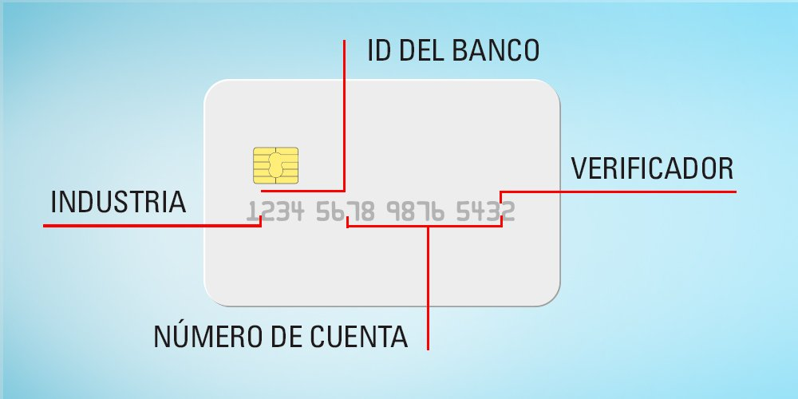

#Reconocimiento de tarjetas de credito / debito con BIN (Número de Identificación Bancaria)
***
###Tarjetas Bancarias:

El número de tarjeta bancaria es el que se encuentra en las tarjetas de pago, en las tarjetas de crédito, en las tarjetas de débito, en las tarjetas de prepago, en las tarjetas de regalo y en otras tarjetas similares.

 Algunos emisores de tarjetas se refieren al número de tarjeta con el número de cuenta primario o PAN (primary account number). Tienen cierto niveles de estructura interna y comparten un esquema de numeración común. Los números de tarjetas bancarias se asignan de acuerdo con la norma ISO / IEC 7812. El número de tarjeta bancaria se limita a identificar la tarjeta, que luego se asocia electrónicamente, a través de la organización emisora, con uno de sus clientes y luego con la cuenta bancaria del cliente. En el caso de las tarjetas de tipo de valor almacenado, no existe una asociación necesaria con un cliente en particular. 

***

###La norma ISO / IEC 7812:

La identificación de emisores fue publicada por primera vez por la Organización Internacional de Normalización (ISO) en 1989. Es la norma internacional que especifica "Un sistema de numeración para la identificación de los emisores de tarjetas, el formato del número de identificación del emisor (IIN) y el número de cuenta principal (PAN) ".

Una manera de identificar la industría a la cual es perteneciente la tarjeta bancaría es fijandonos en el primer digito de esta y utilizar la siguiente tabla.

 
 
 
 

<table id="tg-xzgC7" class="tg">
<thead>
  <tr>
    <th class="tg-4waw">Valor del primer digito</th>
    <th class="tg-rqt1">Categoría emisor</th>
  </tr>
</thead>
<tbody>
  <tr>
    <td class="tg-ys1t">0</td>
    <td class="tg-ys1t">ISO / TC 68 y otras asignaciones futuras de la industria</td>
  </tr>
  <tr>
    <td class="tg-ys1t">1</td>
    <td class="tg-ys1t">Aerolíneas</td>
  </tr>
  <tr>
    <td class="tg-ys1t">2</td>
    <td class="tg-ys1t">Aerolíneas y otras tareas futuras de la industria</td>
  </tr>
  <tr>
    <td class="tg-ys1t">3</td>
    <td class="tg-ys1t">Viajes, entretenimiento y bancario / financiero</td>
  </tr>
  <tr>
    <td class="tg-u7fs">4</td>
    <td class="tg-u7fs">Bancos y financiera</td>
  </tr>
  <tr>
    <td class="tg-u7fs">5</td>
    <td class="tg-u7fs">Bancos y financiera</td>
  </tr>
  <tr>
    <td class="tg-u7fs">6</td>
    <td class="tg-u7fs">Diseño de mercado y bancario / financiero</td>
  </tr>
  <tr>
    <td class="tg-u7fs">7</td>
    <td class="tg-u7fs">Petróleo y otras asignaciones de la industria futuras</td>
  </tr>
  <tr>
    <td class="tg-u7fs">8</td>
    <td class="tg-u7fs">Asistencia sanitaria, telecomunicaciones y otras asignaciones futuras de la industria</td>
  </tr>
  <tr>
    <td class="tg-u7fs">9</td>
    <td class="tg-mmu5">Trabajo Nacional</td>
  </tr>
</tbody>
</table>

***
!!! Question "¿Para que nos es útil conocer como identificar una tarjeta bancaria?"
    La utilidad de evitar falsificaciones de tarjetas bancarias comprobando correctamente el banco del que supuestamente son emitidas, reconocer si cierta tarjeta puede ser aceptada por un establecimiento o también podría ser útil para identificar el publico objetivo de promociones especiales, como una tarjeta de credito que ofrezca promociones sobre viajes cuando el cliente use una tarjeta emitida por el sector de aerolineas.

***

!!! Question "Identificación de tarjetas bancarias"

     

