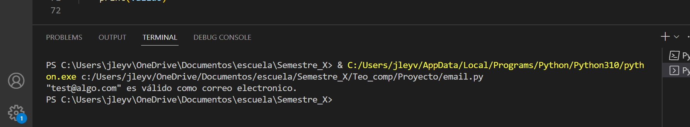
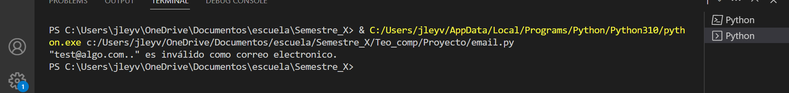
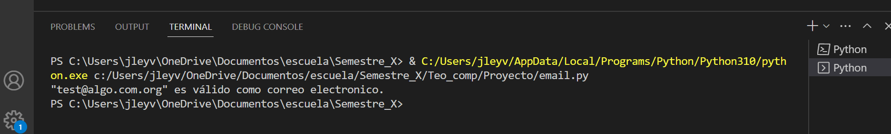
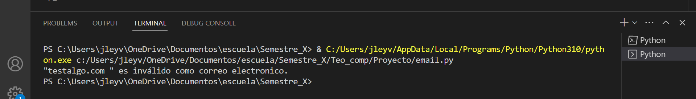

#Ejemplos del funcionamiento
<div class=text-justify>
    Para probarlo usaremos el siguiente codigo, en la variable email se iran sustituyendo los diferentes ejemplos.
</div>

``` python
# Ejemplo de uso
verifier = Verificador()
email = ""  # Dirección de correo electrónico a verificar
valido = verifier.verifica(email)

if valido == 'q5':
    print("\"" + str(email) + "\" es válido como correo electronico.")
elif valido == 'q6':
    print("\"" + str(email) + "\" es inválido como correo electronico.")
else:
    print(valido)
```

<div class=text-justify>
    Ejemplo de entrada test@algo.com, nos dira que es un email válido.
</div>



<div class=text-justify>
    Ejemplo de entrada test@algo.com, nos dira que es un email inválido.
</div>



<div class=text-justify>
    Ejemplo de entrada test@algo.com.org, nos dira que es un email válido.
</div>




<div class=text-justify>
    Ejemplo de entrada testalgo.com, nos dira que es un email inválido.
</div>



<div class=text-justify>
   Con esto ejemplificamos el comportamiento del programar y demostramos su funcionamiento con algunos de los posibles casos.
</div>

