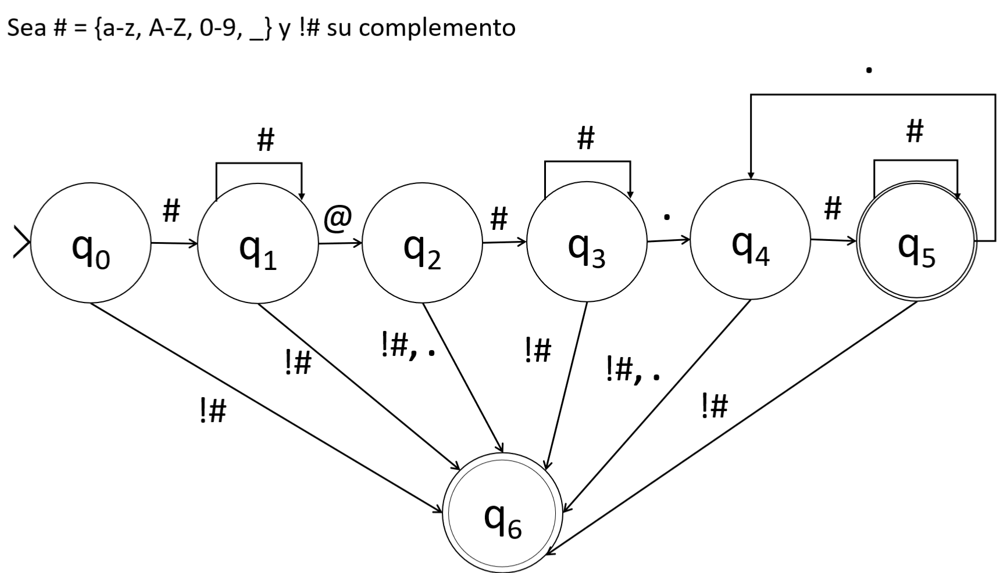

    

#Esquema de funcionamiento

El siguiente grafo es para enseñar como funciona nuestro autómata de una manera mas entendible, apartir de un grafico.

* Estado inicial: El autómata comienza en un estado inicial.

* Leer entrada: El programa lee la dirección de correo electrónico de entrada, un carácter a la vez y lo pasa al autómata.

* Validación de caracteres: El autómata valida los caracteres de la dirección de correo electrónico, verificando si cumplen con las reglas específicas, como la presencia de caracteres permitidos y la posición correcta del símbolo "@".

* Estado de aceptación o rechazo: Si el autómata ha validado con éxito la dirección de correo electrónico y su dominio, pasa a un estado de aceptación, lo que indica que el correo electrónico es válido. Si en cualquier momento se encuentra una violación de las reglas de validación, el autómata pasa a un estado de rechazo, indicando que la dirección de correo electrónico no es válida.

