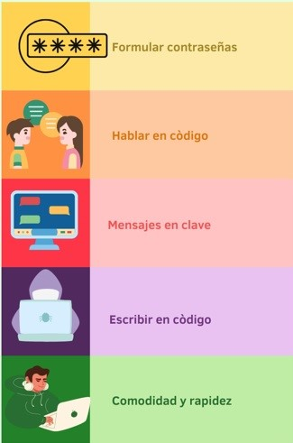

#Verificador de llaves palindromas o Palindrome keys check (PKC)
***
##Descripcion:

Se prente crear un verificador de llaves palindromas esto nos va servir para reconocer si una cadena de entrada es reconocida por la maquina, el proposito es demostrar como a base de un automata podemos verificar si existe un texto palindromo y que tan decifrable seria este si se le intentara hacer criptoanalisis.

***

!!! Question "¿Que es el el PKC?"
    El PKC es un sistema de código abierto que le permite a la organización/usuario verificar si la llave con la que está encriptando es un palíndromo, esto se podría hacer de forma manual (forma aburrida) o bien mediante el sistema PKC (forma chida) ya que este implementa un autómata finito de pila (AFS) para identificar si la llave ingresada es correcta o no.

    Retrospectivamente se ha usado la criptografía palindroma desde el cambio del sentido del alfabeto alineando la métrica a darle otra  interpretaciòn con la simetría para componer instrucciones secretas para aquellos que desconozcan esta forma de encriptar de manera que pueda enviar frases aparentemente sin sentido para resguardar informaciòn en clave.

***

!!! Question "Usos"
     

!!! Question "Ventajas y desventajas"
    * La primera ventaja de utilizar el PKC es que no necesitas perder tiempo verificando si tu llave en palindroma o no.

    * Es mas cool encriptar con palindromos y no con numeros primos ademas quien quiere utilizar un sistema super complejo y desarrollado que cuesta muchisimo dinero para crear números primos gigantescos, es mejor crear tu propia llave palindroma y utilizar tu super divertido sistema de PKC.

    * Instalación sencilla y rápida.

    * Además de contar con un diseño fácil de verificar su contraseña e intuitivo.
 
    * La desventaja de utilizar el PKC es que serás la envidia del mercado.
***

!!! Info "Repositorio Git-Hub"
    * [Version: 1.0.0 - 25/05/2022](https://github.com/Jonhystreet/Verificador-de-llaves-palindromas)