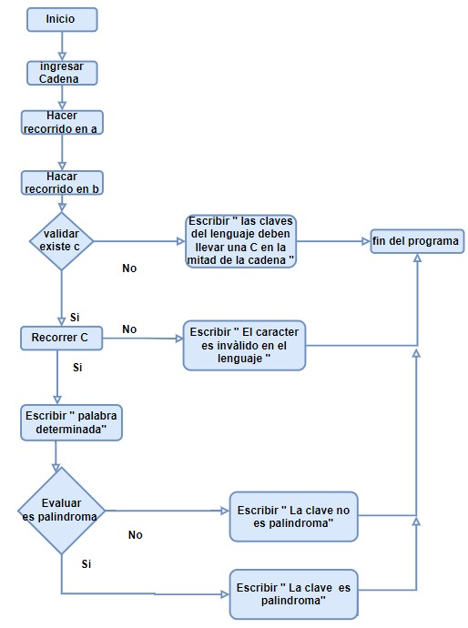

#Esquema de funcionamiento

    El siguiente esquema es para enseñar como funciona por detras nuestro programa de una manera mas entendible, apartir de un grafico y en la parte inferior se describen los pasos de este:

    Inicio

    Ingresa la cadena 

    Hace recorrido para a 

    Hace recorrido para b 

    Válida si existe c

    No: Escribir “Las claves del lenguaje deben llevar al menos una C en la mitad de la cadena”

    Fin del sistema 

    Si:Hace recorrido para c 

    Evalúa si todos  los caracteres son válidos 

    No: Escribir “El caracter es inválido en el lenguaje” 

    Fin del sistema 

    Si: Escribe “palabra terminada” 

    Validar si es un palindromo

    No: Escribir “La clave no es palindroma” 

    Fin del sistema

    Si: Escribir “ La clave es palindroma” 

    Fin del sistema