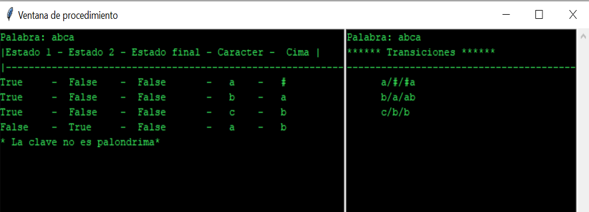
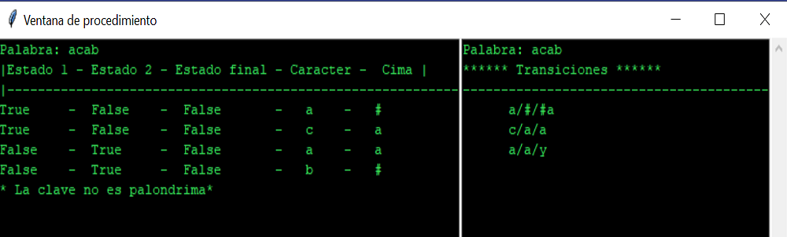
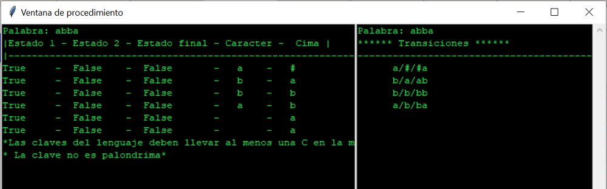
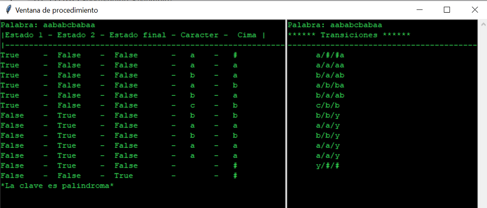

#Ejemplos del funcionamiento

!!! Note ""
    Un palíndromo, también llamado palíndromo, palíndroma o palindroma, es una palabra o frase que se lee igual en un sentido que en otro.

    Ejemplo de entrada abca, recordemos que la c un tipo de separador que debemos recordar no esta presente en el prefijo que lo antecede, nos dira que no es palindromo,referenciandonos a la nota inferior sobre lo que es un palindromo:

    Ejemplo de entrada acab, haremos un ejemplo contrario para visualizar es decir podemos ver que en el primer ejemplo del lado izquierdo era donde teniamos mas entradas ahora lo haremos para el caso del lado derecho:

    Ejemplo de entrada abba, en este ejemplo se quiere demostrar que apesar de que podria considerarse una entrada que es palindroma no se pdora reconocer sin ese separador, propocionando dos salidas que por lo menos debe llevar alguna c para separ y que la clave no es palindroma:

    Ejemplo de entrada aababcbabaa, en esta entrada se cumple con todas las condiciones que la clave sea palindroma, que lleve una c en medio, para poder separar el texto y hacer la verificacion y asu vez podemos comprar que es una llave palindroma :

   Con esto demostramos se quiere ejemplicar el comportamiento del programar y demostrar su funcionamiento con cada uno de los posibles casos que surgan.

