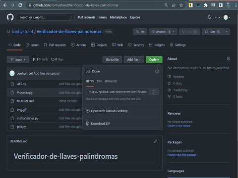
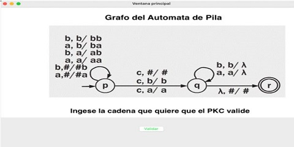
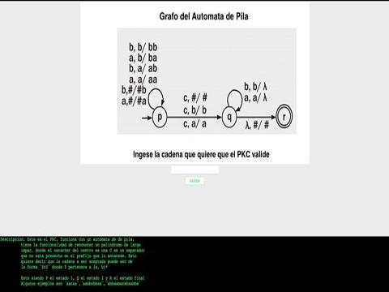
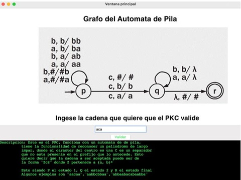
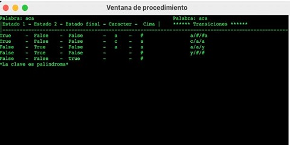
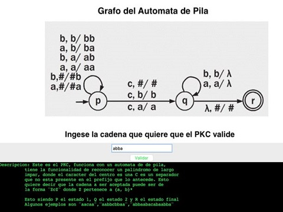
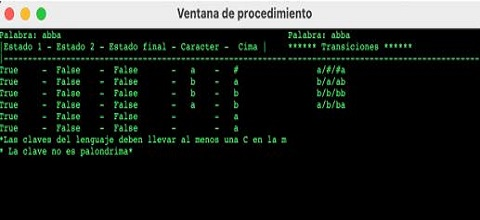

#Instalacion

!!! Question ""
    ##De un sitio alojado en git-hub adjuntado al final de este documento descargamos en formato zip y descomprimimos en una sola carpeta ahi mismo puedes ver las bibliotecas creadas:
    
    ##Una vez descargados los archivos de github en una sola carpeta como la siguiente:
    
    ###Abrira su entorno de programacion favorito que acepte python por ejemplo:
    
    ##Una vez abierto el entorno, arrastrara el archivo de proyecto dentro del entorno:
    
    ###Corremos el codigo y nos arroja la siguiente ventana:
    
    ##A fines practicos aplicamos un metodo de seguridad es decir parece que la ventana no hace nada, pero para poder vizualizar el programa, debemos abrir en pantalla completa el programa:
    
    ##Una ves echo este paso podemos regresar a la pantalla tamaño normal para mayor experiencia de usuario (no vendemos un producto, vendemos una experiencia). Ingresa su cadena que desea validar:
    
    ##Si es una cadena valida en tamaño impar y estructura, sera un resultado correcto:
    
    ##De lo contrario si es una cadena no palindroma se lanzara un mensaje de invalido, este metodo necesita de una C para poder utilizarlo segun nuestro modelo de automata, en caso de no contenerla nos arroja un mensaje de error primero mostraremos la entrada:
    
    ##Y aqui podemos ver el error que arroja:
    

!!! Info "Repositorio Git-Hub - descarga"
    * [Version: 1.0.0 - 25/05/2022](https://github.com/Jonhystreet/Verificador-de-llaves-palindromas)