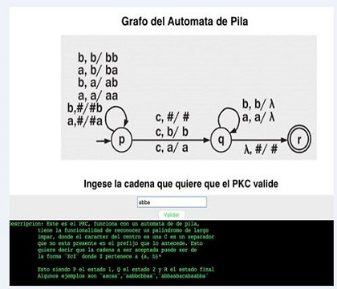

#Biblioteca Instrucciones
<div class=text-justify>
Esta biblioteca acompañara a nuestro ejemplo de uso y nos mostrara un mensaje en la pantalla para ser mas exactos nos creara el contexto de manera texual sobre lo que se esta haciendo de manera grafica:
</div>

***

``` python
        des=[]
        lin='Descripcion: Este es el PKC, funciona con un automata de de pila,'
        lin1='          tiene la funcionalidad de reconocer un palindromo de largo'
        lin2='          impar, donde el caracter del centro es una C es un separador'
        lin3='          que no esta presente en el prefijo que lo antecede. Esto '
        lin4='          quiere decir que la cadena a ser aceptada puede ser de '
        lin5='          la forma ¨ZcZ¨ donde Z pertenece a {a, b}*'
        lin6='          Esto siendo P el estado 1, Q el estado 2 y R el estado final'
        lin7='          Algunos ejemplos son ¨aacaa¨,¨aabbcbbaa¨,¨abbaabacabaabba¨'


        des.append(lin)
        des.append(lin1)
        des.append(lin2)
        des.append(lin3)
        des.append(lin4)
        des.append(lin5)
        des.append('   ')
        des.append(lin6)
        des.append(lin7)
```
